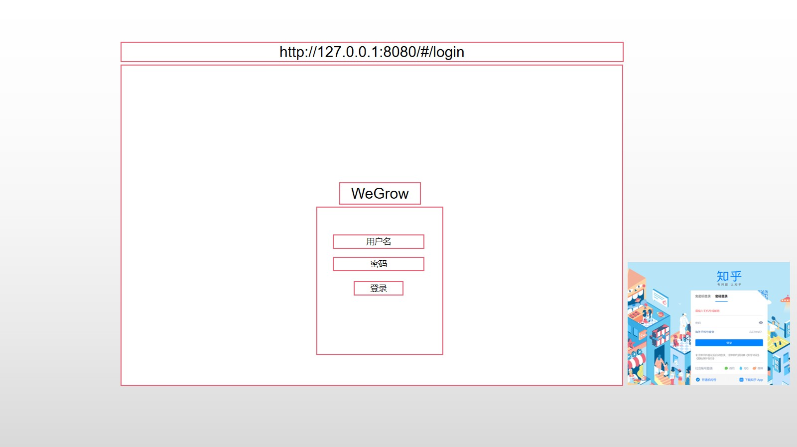

# wegrow-vue

模仿知乎的UI设计，当前支持创建Block、评论、关注用户、用户消息对话和公告通知功能。





## Project setup
```
npm install
```

### Compiles and hot-reloads for development
```
npm run serve
```

### Compiles and minifies for production
```
npm run build
```

### Lints and fixes files
```
npm run lint
```

### Customize configuration
See [Configuration Reference](https://cli.vuejs.org/config/).
